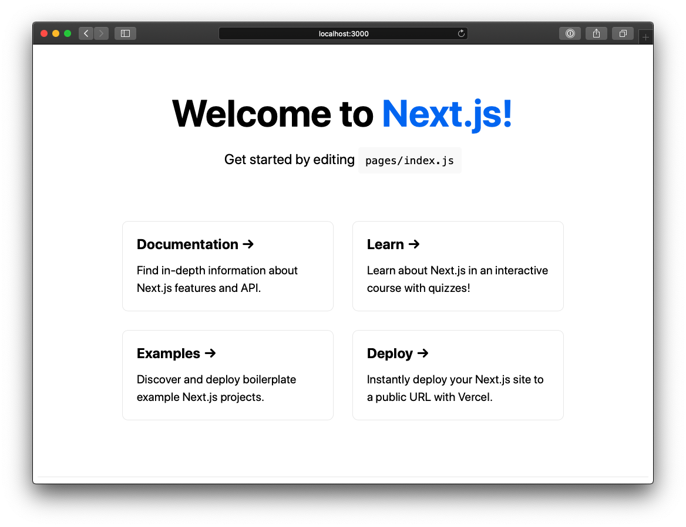

# jasn-link

Source code for the blog posted [here](https://dev.to/dev01d/diy-linktr-ee-with-next-js-2fdh).

<details>
<summary>Original blog</summary>

<!-- title: DIY linktree with Next.js
published: true
description: How to build a linktree site with React
tags: Reactjs, Beginner, JavaScript
cover_image:  -->

## Introduction

Recently, I've been noticing the use of link aggregation services like linktr.ee, ContactInBio, Campsite, etc. become more prevalent so I thought I'd try my hand a replicating it.

For this project, I'm going to use [Next.js](https://nextjs.org) (which is 100% overkill) because I've been looking for an excuse to check it out. This is going to be a quick and fairly dirty build, so there is tons of room for improvement.

## Getting started

First, we need to create a new project. I used yarn, but you can use NPM if you like and if you'd like to read up on Next.js check out [these docs](https://nextjs.org/docs/getting-started).

```bash
yarn create next-app
```

Select default and name it something, then `cd` into that directory.

Now we'll conjure up the dev server and the boilerplate site with this command.

```bash
yarn dev
```

Open up `http://localhost:3000` and make sure you have something that looks like this.

<!-- [](#) -->

<p align="center">
  
</p>

### Head section

In the `index.js` file located in the `pages` directory go ahead and change the `<Head>` section to whatever you want it to be. I changed it to what the pseudo username would be.

```jsx
<Head>
  <title>dev01d</title>
  <link rel="icon" href="favicon.ico" />
</Head>
```

### Profile section

Next, we'll clear out the `<main>` section and replace it with the first element which is the profile picture and "username". We'll leave the default CSS alone because it has most of the stuff we need.

You should now have something like this. (CSS replaced with "..." so the code block is readable)

```jsx
import Head from 'next/head'

export default function Home() {
  return (
    <div className="container">
      <Head>
        <title>dev01d</title>
        <link rel="icon" href="favicon.ico" />
      </Head>

      <main>
        
        <h3 className="description">@dev01d</h3>
      </main>

      <style jsx>{`
       ...
     `}</style>
    </div>
  )
}
```

For the profile image, I just opened the browser dev tools and grabbed my Instagram profile pic URL.

Great! We now have the profile section but your image probably isn't a circle so let's add some CSS for that. Add this anywhere in the `<style jsx>` section.

```css
.image {
  border-radius: 50%;
}
```

### Link section

Ok cool, that looks nice. For the links, we're going to use a grid class and utilize the default CSS with some changes but before we get to the CSS let's get build some link elements.

They're going to be `<a>` tags and we're going to style them with the existing `card` class. This is the general structure I landed on.

```jsx
<div className="grid">
  <a href="https://fake.address" className="card">
    <h3>Buy Prints</h3>
  </a>
</div>
```

Now your index.js should look something like this, but with your info of course.

```jsx
import Head from 'next/head'

export default function Home() {
  return (
    <div className="container">
      <Head>
        <title>dev01d</title>
        <link rel="icon" href="favicon.ico" />
      </Head>

      <main>
        
        <h3 className="description">@dev01d</h3>

        <div className="grid">
          <a href="https://fakewebsite.com" className="card">
            <h3>My Website</h3>
          </a>
          <a href="https://github.com/dev01d" className="card">
            <h3>Github</h3>
          </a>
          <a href="https://medium.com" className="card">
            <h3>Medium</h3>
          </a>
          <a href="https://www.twitch.tv" className="card">
            <h3>Twitch</h3>
          </a>
        </div>
      </main>

      <style jsx>{`
       ...
     `}</style>
    </div>
  )
}
```

### Let's pause and talk about CSS

Everyone has their own way that they like to approach CSS, and this is just the way I decided to do it. If you find a different way to accomplish this or improvements, please drop it in the comments.

### Resume tutorial

The changes and additions I made to are pretty minor. Let’s start with the `.grid` class, all we need to do is reduce the `margin-top` attribute to `1rem`

```css
.grid {
  display: flex;
  align-items: center;
  justify-content: center;
  flex-wrap: wrap;

  max-width: 800px;
  margin-top: 1rem;
}
```

next is the `.card` we'll change `margin` to `0.5rem`, `text-align` to `center`, and background to `#fafafa` to keep it a light color

```css
.card {
  margin: 0.5rem;
  flex-basis: 45%;
  padding: 1.5rem;
  text-align: center;
  background: #fafafa;

  color: inherit;
  text-decoration: none;
  border: 1px solid #eaeaea;
  border-radius: 10px;
  transition: color 0.15s ease, border-color 0.15s ease;
  min-width: 350px;
}
```

Then for the link's label `h3` tag, we need to change the default margin in `.card h3` from `margin: 0 0 1rem 0;`to `margin: 0 3rem 0 3rem;`

Next, for our friends using smaller screens, we want to make sure the links aren't clipping over the edge. We'll add a media query to accommodate them, which should be in the ballpark.

```css
@media (max-width: 350px) {
  .card {
    min-width: 275px;
  }
  .card h3 {
    margin: 0 3rem 0 3rem;
    font-size: 1.25rem;
  }
}
```

### Done!

There we go, we've got our own DIY link aggregator. Now all you need to do is buy a cleverly short domain name, host it somewhere like [vercel.com](https://vercel.com) for free, and throw it up on your Instagram profile.

<!-- [](#) -->
<br>
<p align="center">
  
</p>

#### Ideas for further improvement

The CSS could use a bit of a tweak, a tree shake, and could probably use an a11y audit, but I'll leave that up to you since this is sort of a quick and dirty tutorial.

The code for this project can be found [here](https://github.com/dev01d/devto-link-site).

</details>
